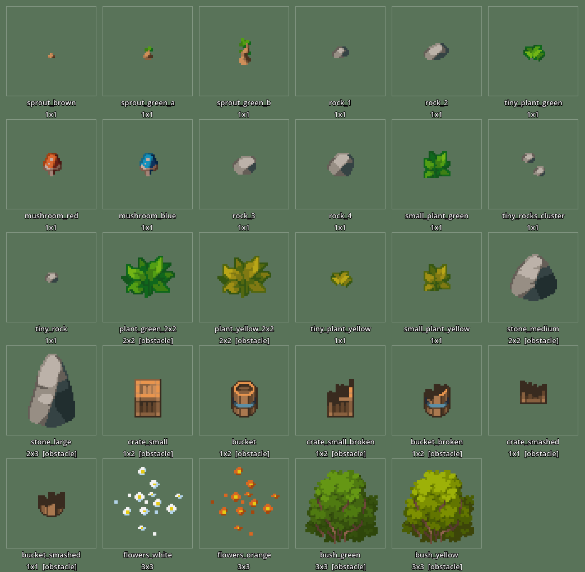

# Props.png — Table of Contents

Catalogue of every usable prop in `Props.png` (Green Woods environment pack).
Generated as part of the spritesheet-ingestion workflow — see
`levels/SPRITESHEET_WORKFLOW.md`.

- **Atlas:** `Props.png` (400×400, 16×16 tile grid)
- **Tiling source of truth:** `levels/decorations/green_woods_props.json`
- **Visual reference:** `PROPS_TOC.png` (each prop extracted + zoomed 3×)

All regions are multiples of 16. "Size" is in tile units (1×1 = 16×16 px).
Obstacle props get collision in their scene; passable props are sprite-only.

## Sprouts & tiny plants (passable)

| Name | Region (x,y,w,h) | Size | Notes |
|---|---|---|---|
| sprout_brown | 0, 0, 16, 16 | 1×1 | Bare brown sprout |
| sprout_green_a | 16, 0, 16, 16 | 1×1 | Sprout, small green tip |
| sprout_green_b | 32, 0, 16, 16 | 1×1 | Sprout, larger leaves |
| tiny_plant_green | 0, 16, 16, 16 | 1×1 | Smallest green leaf tuft |
| tiny_plant_yellow | 32, 48, 16, 16 | 1×1 | Yellow variant of tiny_plant |
| small_plant_green | 32, 32, 16, 16 | 1×1 | Fuller green leaf tuft |
| small_plant_yellow | 32, 64, 16, 16 | 1×1 | Yellow variant of small_plant |

## Mushrooms (passable)

| Name | Region (x,y,w,h) | Size | Notes |
|---|---|---|---|
| mushroom_red | 16, 16, 16, 16 | 1×1 | Red-capped |
| mushroom_blue | 32, 16, 16, 16 | 1×1 | Blue-capped |

## Rocks (passable)

| Name | Region (x,y,w,h) | Size | Notes |
|---|---|---|---|
| tiny_rock | 64, 32, 16, 16 | 1×1 | Smallest single rock |
| tiny_rocks_cluster | 48, 32, 16, 16 | 1×1 | Two tiny rocks |
| rock_1 | 48, 0, 16, 16 | 1×1 | Small rock (size 1 of 4) |
| rock_2 | 64, 0, 16, 16 | 1×1 | Small rock (size 2 of 4) |
| rock_3 | 48, 16, 16, 16 | 1×1 | Small rock (size 3 of 4) |
| rock_4 | 64, 16, 16, 16 | 1×1 | Small rock (size 4 of 4, largest) |

## Plants — large (obstacle)

| Name | Region (x,y,w,h) | Size | Notes |
|---|---|---|---|
| plant_green_2x2 | 0, 32, 32, 32 | 2×2 | Large green leafy plant |
| plant_yellow_2x2 | 0, 64, 32, 32 | 2×2 | Yellow variant |

## Stones — large (obstacle)

| Name | Region (x,y,w,h) | Size | Notes |
|---|---|---|---|
| stone_medium | 80, 0, 32, 32 | 2×2 | Rounded boulder |
| stone_large | 80, 32, 32, 48 | 2×3 | Tall pointed boulder |

## Crates & buckets (obstacle)

| Name | Region (x,y,w,h) | Size | Notes |
|---|---|---|---|
| crate_small | 112, 0, 16, 32 | 1×2 | Intact crate |
| bucket | 128, 0, 16, 32 | 1×2 | Intact bucket |
| crate_small_broken | 112, 32, 16, 32 | 1×2 | Broken crate |
| bucket_broken | 128, 32, 16, 32 | 1×2 | Broken bucket |
| crate_smashed | 112, 64, 16, 16 | 1×1 | Smashed crate remains |
| bucket_smashed | 128, 64, 16, 16 | 1×1 | Smashed bucket remains |

## Flower patches (passable)

| Name | Region (x,y,w,h) | Size | Notes |
|---|---|---|---|
| flowers_white | 144, 0, 48, 48 | 3×3 | White daisy scatter |
| flowers_orange | 144, 48, 48, 48 | 3×3 | Orange flower scatter |

## Bushes (obstacle)

| Name | Region (x,y,w,h) | Size | Notes |
|---|---|---|---|
| bush_green | 0, 96, 48, 48 | 3×3 | Large green bush |
| bush_yellow | 0, 144, 48, 48 | 3×3 | Yellow variant |
