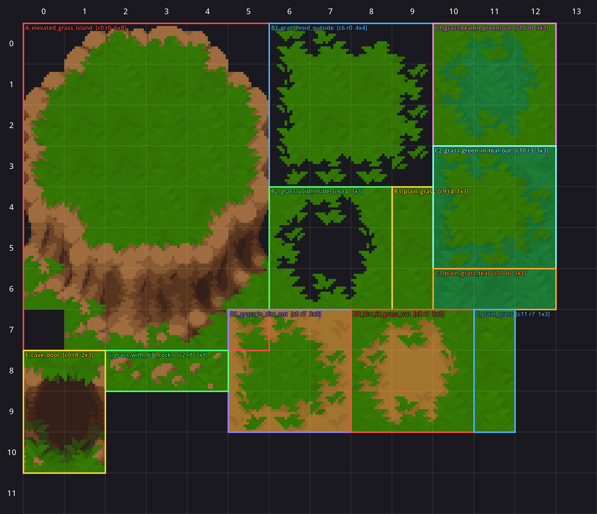

# Tiles.png — Table of Contents

Catalogue of the terrain tiles in `Tiles.png` (Green Woods environment pack).
Generated as part of the spritesheet-ingestion workflow — see
[`levels/SPRITESHEET_WORKFLOW.md`](../../../../../levels/SPRITESHEET_WORKFLOW.md).

- **Atlas:** `Tiles.png` (400×400, 16×16 tile grid)
- **TileSet:** `tiles.tres` (the registered terrains live here)
- **Block map source of truth:** `levels/decorations/green_woods_tiles_blocks.json`
- **Visual reference:** `TILES_TOC.png` (blocks overlaid on the atlas, with cell row/col numbers)

## How terrain tiles work

Unlike props, tiles aren't placed individually — they're painted via Godot's
**terrain autotiling**. Each tile in a terrain is tagged once with "peering
bits" (which terrain sits on each of its 8 neighbours). Then
`TileMap.set_cells_terrain_connect(layer, cells, terrain_set, terrain)` paints a
region and Godot auto-selects the right edge/corner/centre tile for every cell.
You never hand-pick middle vs edge tiles.

`GroundPainter` (see STAGE_BUILDING.md) drives this for stages.

## Blocks in Tiles.png

Each "block" is one autotile template or a strip of plain tiles. Cells are
`[col, row, w, h]` in 16-px tile units.

| Block | Cells | What it is |
|---|---|---|
| A_elevated_grass_island | 0,0 6×8 | Grass plateau ringed by a brown **cliff** — for raised, inaccessible terrain. Corners of the bounding box are empty. |
| B1_grass_void_outside | 6,0 4×4 | Grass island with transparent **void** outside — grass over empty space |
| B2_grass_void_inside | 6,4 3×3 | Grass with a void **hole** in the middle |
| B3_plain_grass | 9,4 1×3 | 3 plain grass tiles, pattern variants |
| C1_grass_teal_in_green_out | 10,0 3×3 | Teal grass inside, green grass outside (autotile) |
| C2_grass_green_in_teal_out | 10,3 3×3 | Green grass inside, teal grass outside (autotile) |
| C3_plain_grass_teal | 10,6 3×1 | 3 plain teal-grass tiles, pattern variants |
| D1_grass_in_dirt_out | 5,7 3×3 | Grass inside, dirt outside (autotile) |
| D2_dirt_in_grass_out | 8,7 3×3 | Dirt inside, grass outside (autotile) |
| F_plain_grass | 11,7 1×3 | 3 more plain grass tiles |
| G_grass_with_dirt_rocks | 2,8 3×1 | 3 grass tiles speckled with small dirt rocks |
| E_cave_door | 0,8 2×3 | A cave-mouth "door" — meant to be placed in an elevated-island cliff wall |

## Registered terrains (`tiles.tres`, terrain set 0)

`tools/register_terrains.gd` registers terrains from the block map. Currently:

| Terrain | id | Source blocks | Notes |
|---|---|---|---|
| **Grass** | 0 | D1 + plain variants B3, F | The base ground. Multiple plain-variant tiles give subtle fill variety. |
| **Dirt** | 1 | D2 | Light/sandy worn-dirt look. Used for paths. |
| **Teal Grass** | 2 | C1 + C2 | A darker grass — for variety patches. |

**Path caveat:** the Grass↔Dirt set is an 18-tile minimal autotile. It cleanly
autotiles a path **≥ 3 cells wide**; a 1-2 wide strip has no matching tile and
looks broken. Paths must be 3+ wide.

## NOT registered (deferred)

- **A (elevated grass island)** — a large custom-shaped template (cliff). Needs
  its peering bits worked out by hand; deferred until a stage needs elevation.
- **B1 / B2 (grass/void)** — "void" isn't a normal paintable terrain; needs
  special handling. Deferred.
- **G (grass with dirt rocks)** — *not* registered as fill: as random grass-fill
  variety it produced uniform rock-speckle noise. Kept in the block map for
  future deliberate placement.
- **E (cave door)** — a decoration/structure, not a terrain.
